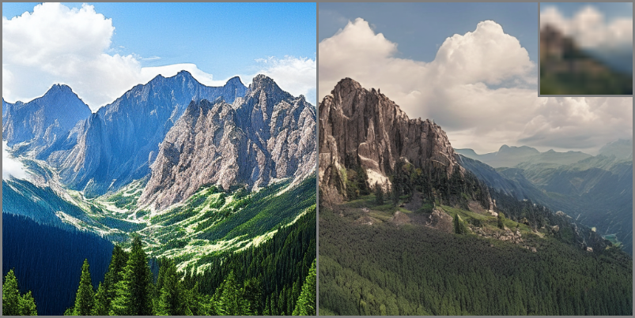
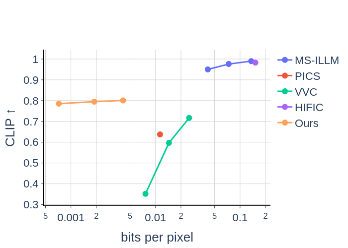
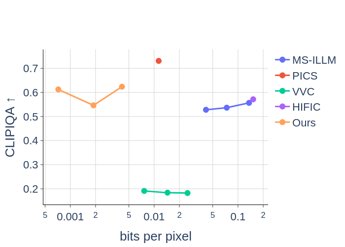
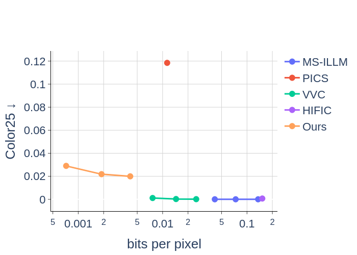
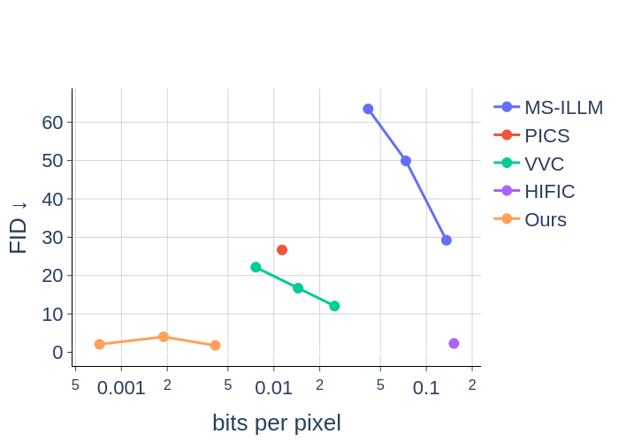
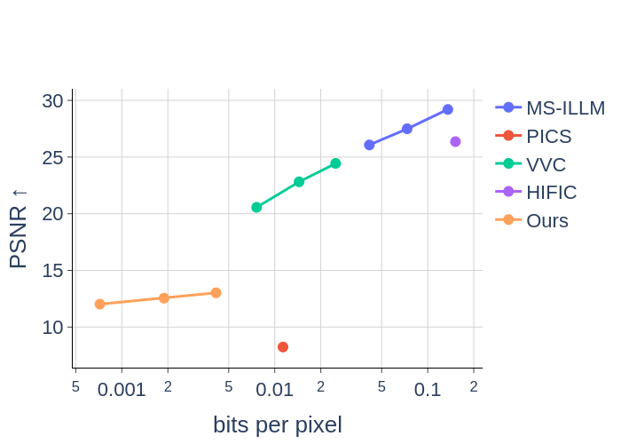
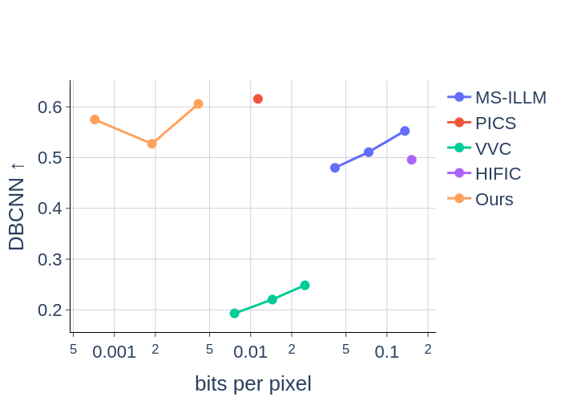
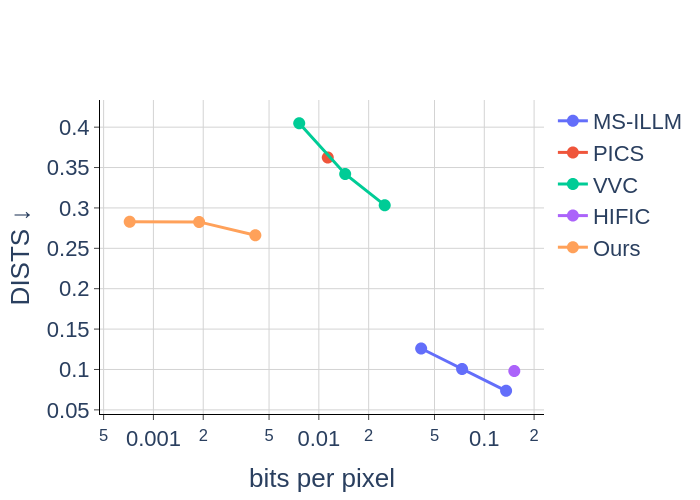
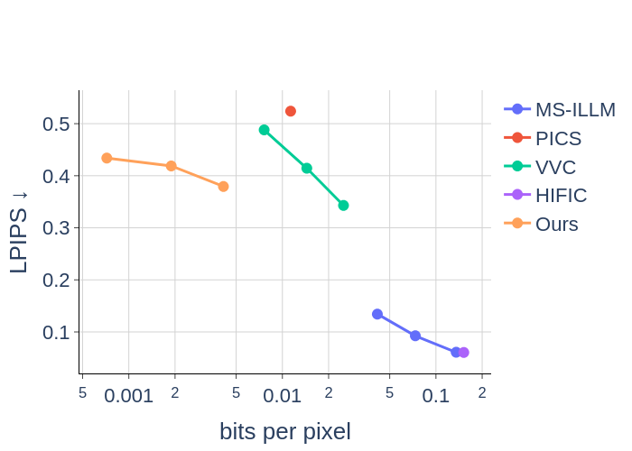

# Color-guidance

Official implementation of the article: "Linearly transformed color guide for low-bitrate diffusion based image compression" [[Paper]](https://arxiv.org/pdf/2404.06865)

<p align="middle">
  


## Abstract

This study addresses the challenge of controlling the global color aspect
of images generated by a diffusion model without training or fine-tuning.
We rewrite the guidance equations to ensure that the outputs are closer to
a known color map, without compromising the quality of the generation.
Our method results in new guidance equations. In the context of color 
guidance, we show that the scaling of the guidance should not decrease but
rather increase throughout the diffusion process. In a second contribution,
our guidance is applied in a compression framework, where we combine both
semantic and general color information of the image to decode at low cost.
We show that our method is effective in improving the fidelity and realism
of compressed images at extremely low bit rates ($10^{-2}$bpp), performing 
better on these criteria when compared to other classical or more semantically
oriented approaches.


<p float="middle">
  
   
  
  
</p>
<p float="middle">
  
   
  
  
</p>


## Install

This code was developed in python 3.12.
To install download the repository and install the packages in requirements.txt in your environment:
```commandline
pip install -r requirements.txt
```

Since the gradients of the model are computed, a large amount of GPU memory is required.

## Run the project

Edit the config.py file to specify the path to your images, cache and output folders:

```python
CFG = {
    "exp_name": "default_config",  # name of the experiment output folder
    "data_dir": "./test_images/",  # path to your image folder
    "cache_dir": "./cache/",  # path to cache models
    "save_dir": "./output_folder/",  # path for the output folder
    "clip_scale": 4.1,
    "color_scale": 6.1,
    "steps": 50,
    "image_dim": 768,
    "nb_color": 25,
    "log_n_image": 1,  # number of intermediate image logged
    "repeat": 4,
    "lambda_vals": "./lambdas/lambda_ts.txt",
    "mean_shift_vals": "./lambdas/mean_shift_latent.txt",
    "std_shift_vals": "./lambdas/std_shift_latent.txt",
    "prompt": "",
    "neg_prompt": "painting, drawing, blurry",
    "cmap_b": 8,  # number of bits to encode color channels
    "clip_b": 5,  # number of bits to encode clip vector components
    "guide_diffusion": True  # Leave true to guide the diffusion with color
}
```

And run simply using:
```commandline
python main.py
```

The rate presented in the paper are obtained after an entropy coding which is not included in this repository.
They can be obtained using the ANS coder from the [constriction](https://pypi.org/project/constriction/) python package.

## License

This work is licensed under the terms of the MIT license.

## Citation

If you use the work released here for your research, please cite this paper:
```
@article{
}
```